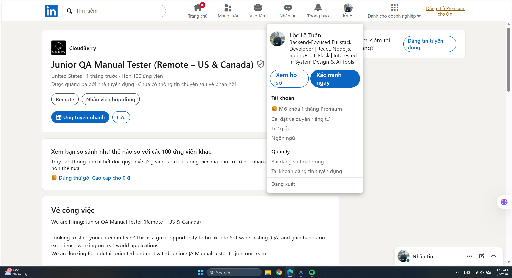
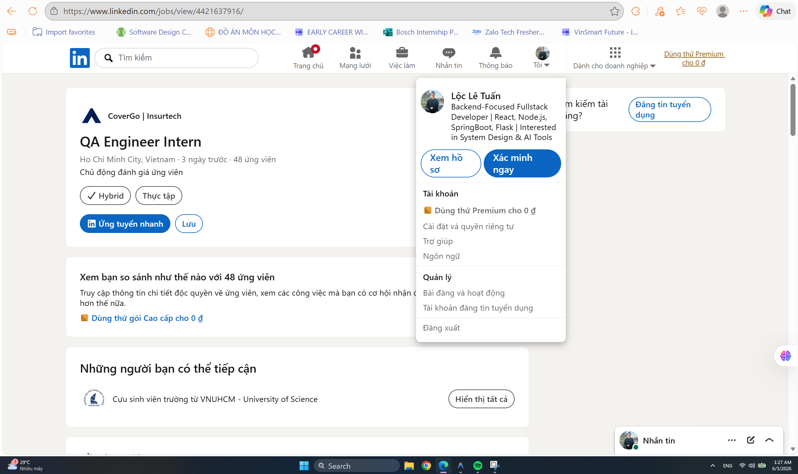
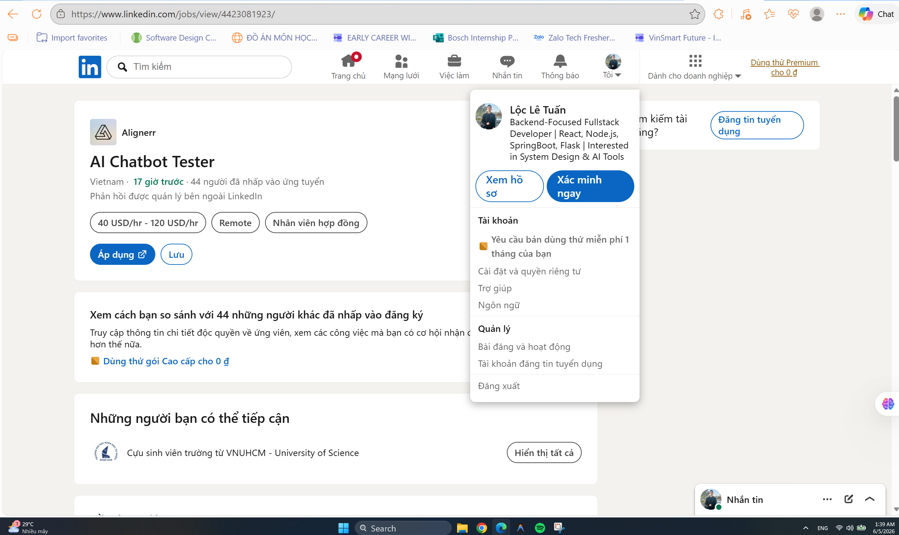
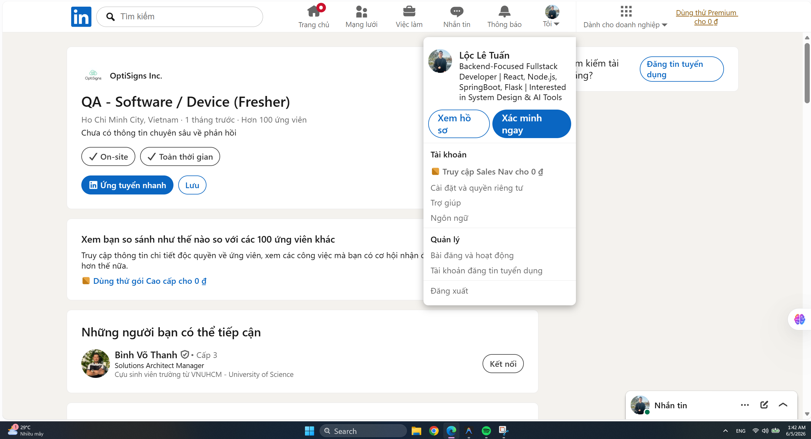
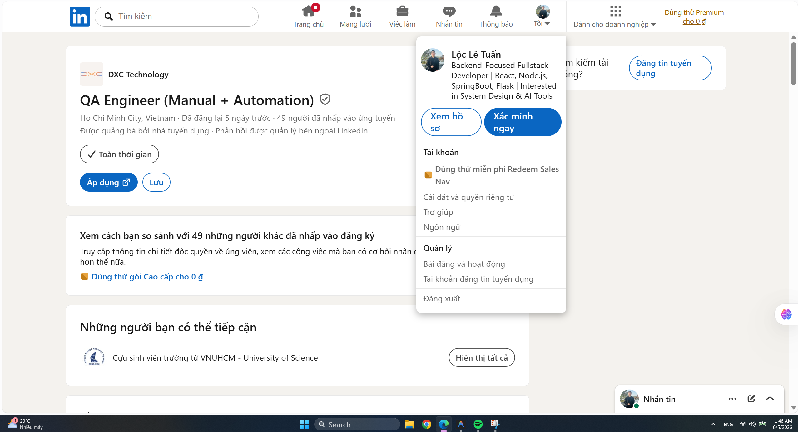
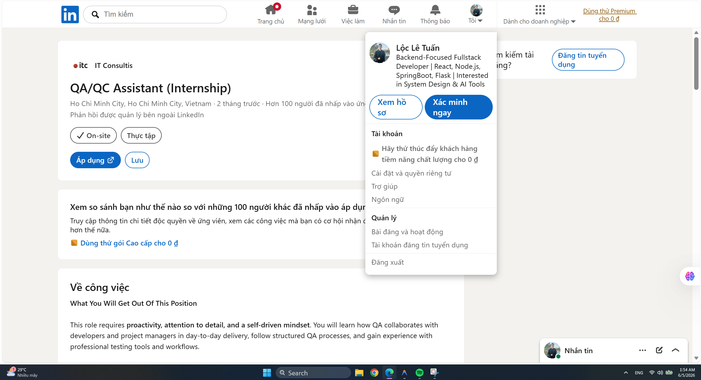
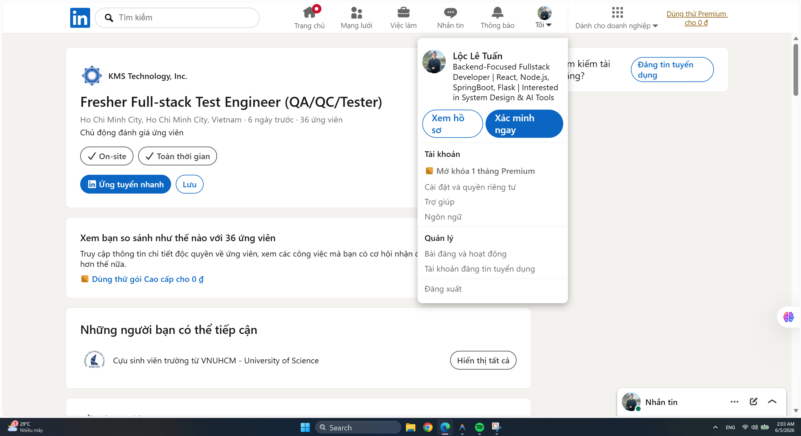
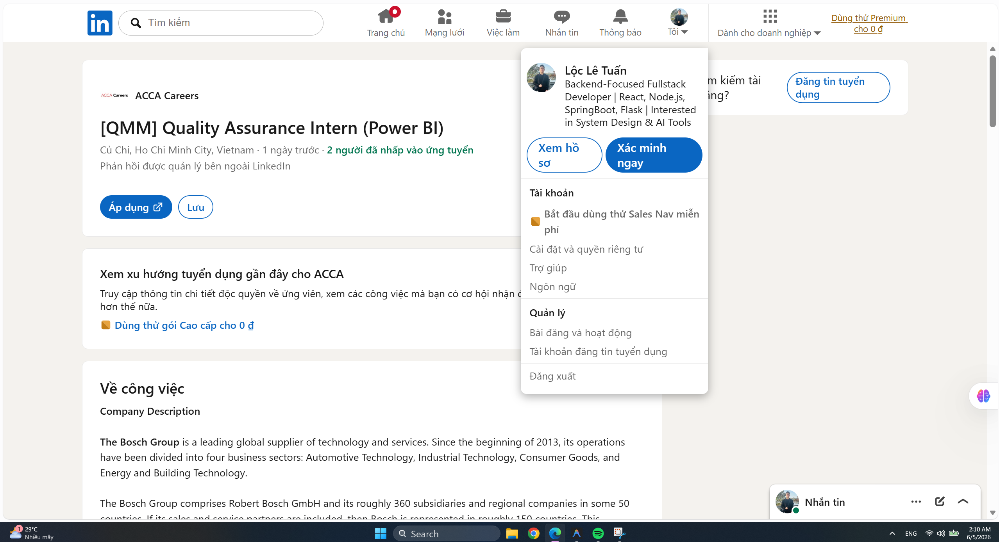
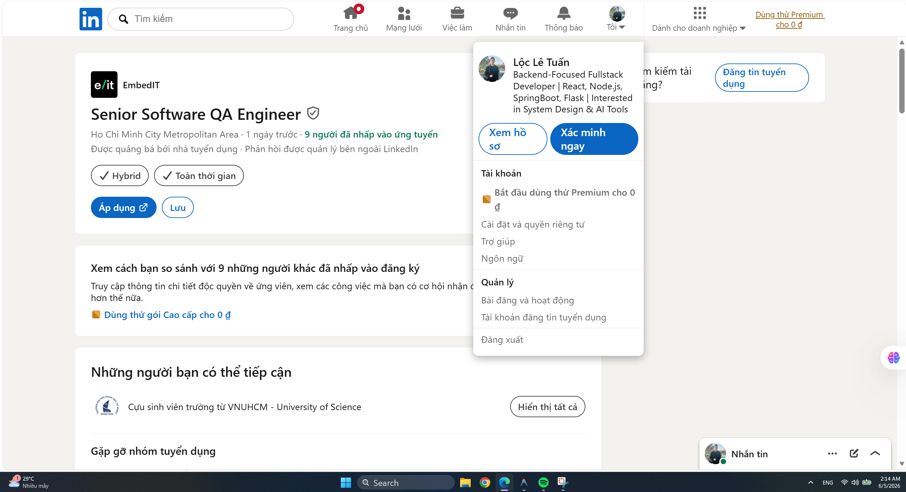
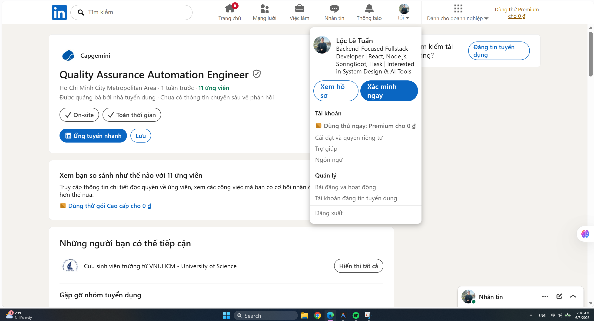

# TRƯỜNG ĐẠI HỌC KHOA HỌC TỰ NHIÊN - ĐHQG-HCM
## KHOA CÔNG NGHỆ THÔNG TIN
### BỘ MÔN CÔNG NGHỆ PHẦN MỀM

<br>

<div align="center">

# BÁO CÁO BÀI TẬP VỀ NHÀ 1
## MÔN HỌC: KIỂM THỬ PHẦN MỀM (SE310)
### ĐỀ TÀI: KIỂM THỬ PHẦN MỀM VỚI SỰ HỖ TRỢ CỦA AI (HW01 AI)

<br>
<br>

**Họ và tên:** Lê Tuấn Lộc  
**Mã số sinh viên:** 23127404
**Lớp:** 23KTPM3  
**Giảng viên hướng dẫn:** 
Trần Thị Bích Hạnh    
Trương Phước Lộc
Hồ Tuấn Thanh  

<br>

**Điểm tự đánh giá (Self-Assessment Grade):** `[Điểm 3 chữ số, ví dụ: 095]/100`

<br>
<br>

*Thành phố Hồ Chí Minh, Tháng 6 Năm 2026*

</div>

---

## MỤC LỤC
1. [Khởi động (Warm-up): Bản đồ tư duy ISTQB & Vai trò QA/QC](#1-phần-khởi-động-warm-up-bản-đồ-tư-duy-istqb-quy-trình--vai-trò-qaqc)
2. [Yêu cầu 1: Thị trường việc làm QA/QC 2026+](#2-yêu-cầu-1-thị-trường-việc-làm-qaqc-2026)
3. [Yêu cầu 2: 20 Lỗi phần mềm nổi tiếng giai đoạn 2022–2026](#3-yêu-cầu-2-20-lỗi-phần-mềm-nổi-tiếng-giai-đoạn-20222026)
4. [Yêu cầu 3: Thiết kế & Thực thi kiểm thử cho thiết bị vật lý](#4-yêu-cầu-3-thiết-kế--thực-thi-kiểm-thử-cho-thiết-bị-vật-lý)
5. [Báo cáo tuân thủ AI (AI Compliance & Audit Report)](#5-báo-cáo-tuân-thủ-ai-ai-compliance--audit-report)
6. [Nhận xét về AI (AI Critique)](#6-nhận-xét-về-ai-ai-critique)
7. [Khai báo bắt buộc & Biểu mẫu (Mandatory Disclosure & Forms)](#7-khai-báo-bắt-buộc--biểu-mẫu-mandatory-disclosure--forms)

---

## 1. Phần khởi động (Warm-up): Bản đồ tư duy ISTQB Quy trình & Vai trò QA/QC

### 1.1. Bản đồ tư duy do AI tạo ra (Ban đầu)
- **Công cụ AI sử dụng:** [Ví dụ: ChatGPT / Claude / Gemini]
- **Prompt yêu cầu vẽ bản đồ:**
  > [Nhập prompt của bạn tại đây]
- **Hình ảnh/Markdown Mindmap ban đầu:**
  

### 1.2. Phân tích 3 lỗi sai/thiếu sót trong Mindmap ban đầu
1. **Lỗi/Thiếu sót 1:**
   - *Mô tả:* [Mô tả lỗi sai hoặc phần thiếu sót của AI so với chuẩn ISTQB]
   - *Lý do sai/thiếu:* [Giải thích dựa trên kiến thức ISTQB]
2. **Lỗi/Thiếu sót 2:**
   - *Mô tả:* [Mô tả lỗi sai hoặc phần thiếu sót của AI so với chuẩn ISTQB]
   - *Lý do sai/thiếu:* [Giải thích dựa trên kiến thức ISTQB]
3. **Lỗi/Thiếu sót 3:**
   - *Mô tả:* [Mô tả lỗi sai hoặc phần thiếu sót của AI so với chuẩn ISTQB]
   - *Lý do sai/thiếu:* [Giải thích dựa trên kiến thức ISTQB]

### 1.3. Bản đồ tư duy hoàn chỉnh (Đã chỉnh sửa)
- **Hình ảnh/Markdown Mindmap sau khi sửa lỗi:**
  

---

## 2. Yêu cầu 1: Thị trường việc làm QA/QC 2026+

*Tổng hợp thông tin của 10 tin tuyển dụng trong vòng 60 ngày gần nhất (tính đến ngày nộp bài), trong đó có ít nhất 3 tin yêu cầu kỹ năng AI/LLM/Automation-AI.*

### Danh sách 10 Tin tuyển dụng

#### Tin tuyển dụng 1: Junior QA Manual Tester (Remote – US & Canada) || CloudBerry
- **Link gốc tuyển dụng:** https://www.linkedin.com/jobs/view/4406136551/
- **Yêu cầu AI/LLM/Automation-AI:** Không
- **Mức lương:** Không có
- **Mô tả công việc:**
  ```text
  We are Hiring: Junior QA Manual Tester (Remote – US & Canada)
  
  
  
  Looking to start your career in tech? This is a great opportunity to break into Software Testing (QA) and gain hands-on experience working on real-world applications.
  
  We are looking for a detail-oriented and motivated Junior QA Manual Tester to join our team.
  
  
  
  Role: Junior QA Manual Tester
  
  Location: Remote (US & Canada)
  
  Experience: 0–2 years (Freshers welcome)
  
  
  
  Responsibilities:
  
  Understand business requirements and create test cases
  Perform manual testing on web and mobile applications
  Identify, log, and track bugs using tools like Jira
  Collaborate with developers and product teams
  Participate in Agile/Scrum processes
  Requirements:
  
  Basic understanding of QA / Software Testing concepts
  Knowledge of SDLC and STLC
  Strong attention to detail and problem-solving skills
  Good communication skills
  Familiarity with tools like Jira, TestRail, or Postman is a plus
  Nice to Have:
  
  Basic SQL knowledge
  Exposure to API testing
  Awareness of automation tools such as Selenium or Playwright
  What You Will Get:
  
  100% remote work environment
  Hands-on experience with real-world projects
  Mentorship and learning opportunities
  Career growth path into Automation or SDET roles
  ```
- **Kỹ năng yêu cầu:**
  - Basic understanding of QA / Software Testing concepts
  - Knowledge of SDLC and STLC
  - Strong attention to detail and problem-solving skills
  - Good communication skills
  - Familiarity with tools like Jira, TestRail, or Postman is a plus
- **Phân tích tác động của AI:** Mặc dù vị trí này tập trung vào kiểm thử thủ công truyền thống, các công cụ AI vẫn có tác động lớn bằng cách hỗ trợ kiểm thử viên tự động sinh các kịch bản kiểm thử (test cases) cơ bản từ mô tả yêu cầu, từ đó rút ngắn thời gian chuẩn bị và buộc kiểm thử viên phải tập trung nhiều hơn vào các ca kiểm thử biên phức tạp.
- **Ảnh chụp màn hình:**
  

#### Tin tuyển dụng 2: QA Engineer Intern || CoverGo | Insurtech
- **Link gốc tuyển dụng:** https://www.linkedin.com/jobs/view/4421637916/
- **Yêu cầu AI/LLM/Automation-AI:** Không
- **Mức lương:** Thỏa thuận
- **Mô tả công việc:**
  ```text
  Top 3 Reasons To Join Us
  
  International Environment
  Working on the latest tech for the Insurtech Market Leader
  Exposure to Diverse HR Functions
  
  About Us
  
  At CoverGo, our mission is to empower all insurance companies to make insurance 100% digital and accessible to everyone.
  
  We are a leading global no-code insurance platform for health, life, and P&C
  We're the winner of the Insurtech of the Year in all of Asia and other awards globally
  We work with insurance enterprise clients such as AXA, Bupa, MSIG, Dai-ichi, Bank of China Group Insurance, and many more
  We're an international, diverse team of over 120 people with 30 nationalities and team members working remotely from all over the world
  We are fully funded and backed by reputable VC funds and strategic institutional investors
  We have a global presence in Asia, EMEA and the Americas
  We've grown our annualized revenue by over 30x since January 2021
  We're constantly working towards making CoverGo a workplace that you love coming to. We deeply believe that bringing together a diversity of thoughts, expressions, and perspectives is key to building the best culture for equally diverse communities all over the world
  
  About The Role
  
  We are looking for a motivated and enthusiastic QA Engineer Intern to join our engineering team. This is a fantastic opportunity for students or recent graduates to gain hands-on experience in software testing while working on an internal tool that tracks and presents delivery metrics from Jira and other corporate platforms.
  
  In this role, you will be involved in verifying both backend and frontend functionalities, ensuring the reliability of real internal systems and cross-functional data. Working closely with our engineering team, you will gain practical exposure to real-world software testing lifecycles and development workflows while growing in a supportive and collaborative environment.
  
  What You Will Do
  
  Perform automated testing on new technologies and features to ensure their reliability and functionality
  Identify and report defects in applications, contributing to product quality improvement
  Collaborate with Business Analysts and other stakeholders to understand feature implementations and project requirements
  Write and execute test scenarios to ensure comprehensive coverage
  Support the enhancement and maintenance of existing test frameworks
  Investigate and assist in determining the root cause of bugs
  Contribute to test plans for projects and features, ensuring a structured testing approach
  Assist in creating tailored test frameworks for projects that can be reasonably automated
  Manage and triage reported defects, collaborating with developers to resolve issues
  Continuously support improvements in the testing infrastructure for better reliability
  Stay informed on features delivered by other teams to understand possible system interactions
  Provide code updates and utilities to support the testing process when necessary
  
  What We Need
  
  Currently a 3rd or 4th-year student in Computer Science, Information Technology, or a related field, or a recent graduate
  Familiar with the Software Testing Life Cycle (STLC) and Agile methodologies
  Fluent in English (written and verbal) for clear collaboration and reporting
  Strong analytical, problem-solving, and detail-oriented mindset
  Practical exposure to programming languages (e.g., JavaScript, Python, Java)
  Familiarity with automation testing frameworks like Selenium, Cypress, or Postman
  Basic knowledge of Git, CI/CD workflows, or SQL databases
  Strong mathematical aptitude or prior experience in programming contests
  Strong attention to detail with logical thinking and problem-solving skills
  Proactive, self-motivated, and eager to learn
  Ability to work independently as well as collaboratively within a team
  Must be based in Ho Chi Minh City, Vietnam
  
  Why You'll Love Working Here
  
  Hybrid Setup
  International Environment
  Professional Development Opportunities
  Company activities and events
  ```
- **Kỹ năng yêu cầu:**
  - Currently a 3rd or 4th-year student in Computer Science, Information Technology, or a related field, or a recent graduate
  - Familiar with the Software Testing Life Cycle (STLC) and Agile methodologies
  - Fluent in English (written and verbal) for clear collaboration and reporting
  - Strong analytical, problem-solving, and detail-oriented mindset
  - Practical exposure to programming languages (e.g., JavaScript, Python, Java)
  - Familiarity with automation testing frameworks like Selenium, Cypress, or Postman
  - Basic knowledge of Git, CI/CD workflows, or SQL databases
  - Strong mathematical aptitude or prior experience in programming contests
  - Strong attention to detail with logical thinking and problem-solving skills
  - Proactive, self-motivated, and eager to learn
  - Ability to work independently as well as collaboratively within a team
  - Must be based in Ho Chi Minh City, Vietnam
- **Phân tích tác động của AI:** AI hỗ trợ viết nhanh mã kịch bản tự động hóa (automation scripts) và sinh dữ liệu thử nghiệm, giúp thực tập sinh tối ưu hóa năng suất nhưng đòi hỏi kỹ năng rà soát để phát hiện sai sót của AI.
- **Ảnh chụp màn hình:**
  

#### Tin tuyển dụng 3: AI Chatbot Tester || Alignerr
- **Link gốc tuyển dụng:** https://www.linkedin.com/jobs/view/4423081923/
- **Yêu cầu AI/LLM/Automation-AI:** Có
- **Mức lương:** Không công khai (Hourly Contract)
- **Mô tả công việc:**
  ```text
  About The Role
  
  What if your opinion could make AI smarter, safer, and more helpful for millions of people? As an AI Chatbot Tester with Alignerr, that's exactly what you'll do. We're looking for curious, thoughtful individuals to engage with cutting-edge AI chatbots, evaluate their responses, and provide the human feedback that drives real improvement in AI systems.
  
  This is a fully remote, flexible contract role — work on your own schedule, from anywhere.
  
  Organization: Alignerr
  Type: Hourly Contract
  Location: Remote
  Commitment: 10–40 hours/week
  
  What You'll Do
  
  Hold conversations with AI chatbots across a wide range of topics — from everyday questions to creative challenges
  Rate responses for helpfulness, accuracy, tone, and safety
  Identify issues such as factual errors, awkward phrasing, bias, or inappropriate outputs
  Push the limits of AI with creative, nuanced, and challenging prompts
  Record structured feedback that directly informs how AI systems are improved
  Work independently and asynchronously on your own schedule
  
  Who You Are
  
  Naturally curious — you enjoy exploring ideas across different topics and asking great questions
  Able to evaluate written responses critically and objectively
  Clear and concise in your written communication
  Comfortable navigating chat-based digital interfaces
  Reliable and self-motivated when working independently
  No technical background or prior AI experience required
  
  Nice to Have
  
  Experience in writing, editing, journalism, research, or customer service
  Familiarity with AI tools or chatbot platforms
  An eye for spotting subtle errors in logic, tone, or content
  
  Why Join Us
  
  Work on some of the most advanced AI projects in the world, partnering with top research labs
  Fully remote and flexible — set your own hours and work from anywhere
  Freelance autonomy: no micromanagement, no rigid schedules
  Meaningful work that directly shapes the quality and safety of AI used globally
  Potential for ongoing contracts and expanded project opportunities
  ```
- **Kỹ năng yêu cầu:**
  - Naturally curious — you enjoy exploring ideas across different topics and asking great questions
  - Able to evaluate written responses critically and objectively
  - Clear and concise in your written communication
  - Comfortable navigating chat-based digital interfaces
  - Reliable and self-motivated when working independently
  - No technical background or prior AI experience required
- **Phân tích tác động của AI:** Đây là công việc mới được tạo ra trực tiếp bởi làn sóng AI/LLM, đòi hỏi kiểm thử viên đóng vai trò là "huấn luyện viên" để đánh giá và định hình hành vi an toàn của mô hình. Sự phát triển này thúc đẩy sự dịch chuyển từ kiểm thử phần mềm truyền thống sang kiểm định dữ liệu và phản hồi của trí tuệ nhân tạo.
- **Ảnh chụp màn hình:**
  

#### Tin tuyển dụng 4: QA - Software / Device (Fresher) || OptiSigns Inc.
- **Link gốc tuyển dụng:** https://www.linkedin.com/jobs/view/4413964352
- **Yêu cầu AI/LLM/Automation-AI:** Không
- **Mức lương:** Cạnh tranh (Competitive Pay)
- **Mô tả công việc:**
  ```text
  About this Job:
  
  Kick‑start your QA career testing real products used by thousands of businesses worldwide.
  
  Company Overview
  
  OptiSigns is the leading digital signage company in North America, with over 30,500 customers in 121 countries. Our cloud-based platform helps organizations manage screens and content across retail, hospitality, education, and corporate environments. We are a fast-growing, customer-obsessed team building simple, scalable, and reliable products.
  
  The Role: QA Engineer (Fresher)
  
  Learn to test Android, web, and device features, write clear test cases, and help keep releases high‑quality. Training and mentorship provided.
  
  Key Responsibilities
  
   Execute functional, regression, and exploratory tests for apps and devices
   Log reproducible defects with detailed steps, logs, and screenshots
   Maintain test cases and results; assist with smoke/sanity runs
   Collaborate with engineers to verify fixes and improve coverage
  
  Requirements
  
  Requirements
  
   Recent graduate in CS/Engineering or related field
   Detail‑oriented, curious, and eager to learn testing fundamentals
   Basic scripting or SQL is a plus
   Professional English proficiency required
  
  Work Arrangement & Location
  
   On-site, in-office role in Ho Chi Minh City, Vietnam
  
  Benefits
  
  Benefits
  
  Opportunity to travel and work at our U.S. office in Houston, TX
  Latest Macbook Pro
  Competitive Pay
  Company Trip
  Paid time off
  Insurance
  ```
- **Kỹ năng yêu cầu:**
  - Recent graduate in CS/Engineering or related field
  - Detail‑oriented, curious, and eager to learn testing fundamentals
  - Basic scripting or SQL is a plus
  - Professional English proficiency required
- **Phân tích tác động của AI:** Vai trò kiểm thử thiết bị phần cứng và phần mềm truyền thống này chịu tác động của AI thông qua các công cụ hỗ trợ sinh nhanh các kịch bản kiểm thử biên (edge cases). Tuy nhiên, việc thực thi và xác minh thủ công trực tiếp trên thiết bị vật lý vẫn là kỹ năng cốt lõi khó bị thay thế bởi AI.
- **Ảnh chụp màn hình:**
  

#### Tin tuyển dụng 5: QA Engineer (Manual + Automation)  || DXC Technology
- **Link gốc tuyển dụng:** https://www.linkedin.com/jobs/view/4402370820
- **Yêu cầu AI/LLM/Automation-AI:** Không
- **Mức lương:** Cạnh tranh (Attractive and competitive salary package)
- **Mô tả công việc:**
  ```text
  Job Description
  
  DXC Technology (NYSE: DXC) is a leading enterprise technology and innovation partner delivering software, services, and solutions to global enterprises and public sector organizations — helping them harness AI to drive outcomes at a time of exponential change with speed. With deep expertise in Managed Infrastructure Services, Application Modernization, and Industry-Specific Software Solutions, DXC modernizes, secures, and operates some of the world’s most complex technology estates. Learn more on dxc.com
  
  DXC Vietnam has been recognized as one of the "Best Companies to Work for in Asia 2025" by HR Asia Magazine, highlighting its exceptional HR practices and 31-year legacy in the country. The company also earned the special "Most Caring Company Award" in 2025 for prioritizing employee well-being and fostering a supportive, inclusive workplace culture.
  
  We are seeking a QA Engineer (Manual + Automation) to ensure product quality across web and mobile applications. This role is manual‑testing focused but requires hands‑on experience with test automation to support regression and improve testing efficiency.
  
  You will be responsible for the full defect lifecycle using Jira, work closely with cross‑functional teams in an Agile/Scrum environment, and maintain and execute automated test scripts using Katalon Studio and/or TestComplete. Basic API testing using Postman/Katalon is also part of the role.
  
  Job Responsibilities
  
  Analyze business requirements and create detailed test plans, test cases, and test scenarios.
  Execute manual testing including functional, regression, smoke, and UAT for web and mobile applications.
  Log, track, and manage defects in Jira with clear reproduction steps and proper prioritization.
  Collaborate closely with developers, BAs, and Product Owners in an Agile/Scrum environment.
  Perform and support test automation activities, including:
  Maintaining and executing automated test scripts using Katalon Studio and/or TestComplete
  Updating object repositories / name mapping
  Creating small reusable keywords, functions, or scripts
  Conduct basic API testing using Postman or Katalon (REST).
  Contribute to continuous improvement of QA processes, documentation, and test data management.
  Job Requirements
  
  3+ year of experience in QA testing, with strong exposure to manual testing (functional, regression, integration).
  Solid understanding of SDLC/STLC and QA best practices.
  Hands‑on experience with test automation is required, specifically:
  Katalon Studio (Groovy/Java – basic custom keywords)
  and/or TestComplete (JavaScript / VBScript / Python – small functions, name mapping)
  Experience with API testing (Postman / REST); basic SQL knowledge is an advantage.
  English Intermediate (INT); good communication and teamwork skills.
  Detail‑oriented, analytical, and willing to balance manual testing with automation tasks.
  Nice To Have
  
  Git, Jenkins / Azure DevOps
  Test management & reporting tools (Xray, Zephyr)
  
  Employee Benefits And Perks
  
  At DXC Vietnam, we follow a people‑first philosophy, offering competitive compensation and comprehensive benefits that support your professional growth and personal well‑being.
  
  Attractive and competitive salary package
  Full salary‑based contributions to Social Insurance, Health Insurance, and Unemployment Insurance in accordance with Vietnamese law
  13th‑month salary (guaranteed)
  Generous leave policy: 12 annual leave days, 6 personal leave days, 1 volunteer leave day, plus sick leave, maternity/paternity leave, and childcare leave.
  Premium Healthcare Insurance (1+1) for employees and dependents
  Employee Assistance Program (EAP) with confidential 1:1 consultation for physical and mental well‑being to support you and your family
  Access to the Well‑being Hub covering health, mental wellness, and financial planning
  Extensive resources to support your onboarding and continual development including DXC University and sponsorship for professional certification exams.
  DXC Recognition, our global virtual platform that fosters a culture of appreciation and celebration with real-time reward and recognition
  Opportunities to work on global projects, collaborate with international teams, and explore overseas assignments or relocation
  Special allowances and gifts (English/Japanese language allowance, wedding gifts, newborn gifts, etc.)
  Remote work support with a company‑provided laptop
  Annual team activities and company events
  A collaborative, inclusive, and international working environment that promotes knowledge sharing and continuous growth
  
  How To Apply & Our Commitment To You
  
  If you would like to be part of a culture that drives innovation, delivers results, rewards performance, and encourages ideas, please click “Apply Now” to submit your resume.
  
  In return, we are committed to providing a hiring experience that is transparent, fair, and engaging. Interviews and onboarding are conducted online as part of DXC’s virtual‑first approach to work.
  
  Equal Opportunity Employer
  
  DXC Technology is proud to be an Equal Opportunity Employer. We welcome applicants from all backgrounds and celebrate diversity as a source of strength. We believe in bringing your whole self to work, and our company grows only when our people grow.
  
  Reasonable accommodation for qualified candidates may be made in accordance with the DXC Accommodation Policy, including support for individuals with physical and mental disabilities.
  
  At DXC Technology, we believe strong connections and community are key to our success. Our work model prioritizes in-person collaboration while offering flexibility to support wellbeing, productivity, individual work styles, and life circumstances. We’re committed to fostering an inclusive environment where everyone can thrive.
  ```
- **Kỹ năng yêu cầu:**
  - 3+ year of experience in QA testing, with strong exposure to manual testing (functional, regression, integration).
  - Solid understanding of SDLC/STLC and QA best practices.
  - Hands‑on experience with test automation is required, specifically:
  - Katalon Studio (Groovy/Java – basic custom keywords)
  - and/or TestComplete (JavaScript / VBScript / Python – small functions, name mapping)
  - Experience with API testing (Postman / REST); basic SQL knowledge is an advantage.
  - English Intermediate (INT); good communication and teamwork skills.
  - Detail‑oriented, analytical, and willing to balance manual testing with automation tasks.
- **Phân tích tác động của AI:** Với vai trò kết hợp kiểm thử thủ công và tự động hóa (Katalon/TestComplete), AI hỗ trợ đắc lực trong việc sinh mã các hàm tùy chỉnh và tối ưu hóa nhận diện phần tử trên trang. Nhờ đó, QA giảm thiểu thời gian bảo trì kịch bản kiểm thử tự động, chuyển trọng tâm sang phân tích các yêu cầu phức tạp.
- **Ảnh chụp màn hình:**
  

#### Tin tuyển dụng 6: QA/QC Assistant (Internship) || IT Consultis
- **Link gốc tuyển dụng:** https://www.linkedin.com/jobs/view/4395996253/
- **Yêu cầu AI/LLM/Automation-AI:** Không
- **Mức lương:** Cạnh tranh (Competitive salary package)
- **Mô tả công việc:**
  ```text
  What You Will Get Out Of This Position
  
  This role requires proactivity, attention to detail, and a self-driven mindset. You will learn how QA collaborates with developers and project managers in day-to-day delivery, follow structured QA processes, and gain experience with professional testing tools and workflows.
  
  You will join ITC's Production Department, working closely with a QA/QC team and delivery teams on real web and e-commerce projects. This internship offers hands-on exposure to software quality assurance in a production environment, helping you understand how digital products are tested, improved, and prepared for release.
  
  Responsibilities
  
  Support the QA/QC team in executing test cases for web and e-commerce applications
  Perform manual testing on key user flows such as login, product browsing, checkout, and payment
  Help identify, reproduce, and document bugs clearly in project management tools (e.g. ClickUp, Jira)
  Assist in regression testing after bug fixes and new feature releases
  Support preparation of basic QA reports (test results, bug lists)
  Help verify fixes in staging / UAT environments
  Participate in project meetings (kick-off, sprint review, UAT) to understand requirements and QA processes
  Follow QA guidelines, test standards, and documentation templates provided by the team
  
  
  Requirements
  
  Must Have
  
  Final-year student or recent graduate in IT, Computer Science, Software Engineering, or related fields
  Basic understanding of software testing concepts (manual testing, test cases, bugs)
  Ability to read and understand basic source code (HTML/CSS, basic JavaScript logic) for debugging and QA purposes
  Ability to read and understand basic technical or functional requirements
  Candidates with a foundational understanding of Software Testing (e.g., test cases, bug tracking, UAT/SIT) are preferred.
  Basic knowledge of HTML/CSS to support UI testing is considered a plus.
  Good attention to detail and willingness to learn
  Proficiency in English, strong reading & writing skills
  
  
  Nice to Have
  
  Internship or academic experience in QA, testing, or software development
  Familiarity with web applications (e-commerce, portals, dashboards)
  Basic knowledge of tools like Jira, ClickUp, Postman, or browser developer tools
  Basic understanding of Agile/Scrum is a plus
  
  
  The Package
  
  Competitive salary package, aligned with your experience and contributions
  Clear career development path with regular performance reviews and growth opportunities
  Comfortable and well-equipped office space with modern facilities in a central location
  Collaborative and ambitious team culture with shared goals and strong team spirit
  Engaging team-building activities and company events throughout the year
  ```
- **Kỹ năng yêu cầu:**
  - Final-year student or recent graduate in IT, Computer Science, Software Engineering, or related fields
  - Basic understanding of software testing concepts (manual testing, test cases, bugs)
  - Ability to read and understand basic source code (HTML/CSS, basic JavaScript logic) for debugging and QA purposes
  - Ability to read and understand basic technical or functional requirements
  - Candidates with a foundational understanding of Software Testing (e.g., test cases, bug tracking, UAT/SIT) are preferred.
  - Basic knowledge of HTML/CSS to support UI testing is considered a plus.
  - Good attention to detail and willingness to learn
  - Proficiency in English, strong reading & writing skills
- **Phân tích tác động của AI:** Với công việc thực tập kiểm thử thủ công web và e-commerce, các công cụ AI hỗ trợ viết nhanh kịch bản kiểm thử (test cases) mẫu và kiểm tra lỗi UI/UX cơ bản. Tuy nhiên, việc thực thi thực tế để trải nghiệm trực quan hành vi người dùng (UAT) vẫn cần tư duy nhạy bén và sự tỉ mỉ của kiểm thử viên.
- **Ảnh chụp màn hình:**
  

#### Tin tuyển dụng 7: Fresher Full-stack Test Engineer (QA/QC/Tester) || KMS Technology, Inc.
- **Link gốc tuyển dụng:** https://www.linkedin.com/jobs/view/4417931013
- **Yêu cầu AI/LLM/Automation-AI:** Có (Khai thác AI chat tools, AI coding assistant & Prompting)
- **Mức lương:** Không công khai (Thỏa thuận)
- **Mô tả công việc:**
  ```text
  Your key responsibilities:
  
  Develop a strong understanding of domain knowledge and client testing processes to execute testing activities effectively.
  Work closely with the project team on daily tasks and participate in sprint demo meetings with clients.
  Develop, maintain, and execute test cases/test scripts.
  Identify, report, track, and monitor defects using the defect tracking system.
  Prepare and review test documentation to ensure accuracy and completeness.
  Address issues related to testing quality and suggest improvements.
  Communicate test progress, results, and quality risks both internally and directly with the client.
  
  Qualifications
  
  Your key qualifications:
  
  General requirements:
  
  4th-year student or recent graduate with a Bachelor's degree in Information Technology, Computer Science, Software Engineering, or a related field, with less than one (01) year of experience.
  Strong IT background with a GPA of 7.5+ (Please attach transcripts when submitting your CV).
  Upper-intermediate or higher English proficiency (both written and verbal).
  Minimum 3-month internship experience in software testing, automation testing, or a related field is a plus.
  Strong self-learning ability with a proactive, growth-oriented mindset.
  Excellent analytical and problem-solving skills.
  Ability to work independently and collaborate effectively in a team.
  
  Technical requirements:
  
  Solid understanding of software testing concepts and methodologies, including manual, automation, integration, unit, and API testing.
  Solid programming skills in Python / Java / JavaScript, or other relevant languages.
  Familiarity with testing tools (e.g., Selenium, Katalon, Playwright, Appium, JUnit), as well as tools for API testing (e.g., Postman), is a plus.
  
  Nice to have:
  
  Experience using AI chat tools (ChatGPT, Claude, Gemini, etc.) for research, debugging, and learning
  Familiarity with at least one AI coding assistant (GitHub Copilot, Cursor, Claude Code, or similar)
  Ability to write clear, contextual prompts to generate code snippets, unit tests, or documentation
  Awareness of AI output limitations and responsible AI use (data privacy, handling of sensitive client data)
  ```
- **Kỹ năng yêu cầu:**
  - General requirements:
  - 4th-year student or recent graduate with a Bachelor's degree in Information Technology, Computer Science, Software Engineering, or a related field, with less than one (01) year of experience.
  - Strong IT background with a GPA of 7.5+ (Please attach transcripts when submitting your CV).
  - Upper-intermediate or higher English proficiency (both written and verbal).
  - Minimum 3-month internship experience in software testing, automation testing, or a related field is a plus.
  - Strong self-learning ability with a proactive, growth-oriented mindset.
  - Excellent analytical and problem-solving skills.
  - Ability to work independently and collaborate effectively in a team.
  - Technical requirements:
  - Solid understanding of software testing concepts and methodologies, including manual, automation, integration, unit, and API testing.
  - Solid programming skills in Python / Java / JavaScript, or other relevant languages.
  - Familiarity with testing tools (e.g., Selenium, Katalon, Playwright, Appium, JUnit), as well as tools for API testing (e.g., Postman), is a plus.
  - Nice to have:
  - Experience using AI chat tools (ChatGPT, Claude, Gemini, etc.) for research, debugging, and learning
  - Familiarity with at least one AI coding assistant (GitHub Copilot, Cursor, Claude Code, or similar)
  - Ability to write clear, contextual prompts to generate code snippets, unit tests, or documentation
  - Awareness of AI output limitations and responsible AI use (data privacy, handling of sensitive client data)
- **Phân tích tác động của AI:** Tin tuyển dụng này yêu cầu rõ ràng kỹ năng ứng dụng AI trong quy trình phát triển và kiểm thử (như viết prompt sinh test cases, sinh mã kiểm thử). Điều này chứng minh xu hướng các công ty IT hàng đầu đang tích hợp AI vào quy trình làm việc thực tế của kỹ sư kiểm thử.
- **Ảnh chụp màn hình:**
  

#### Tin tuyển dụng 8: [QMM] Quality Assurance Intern (Power BI) || ACCA Careers
- **Link gốc tuyển dụng:** https://www.linkedin.com/jobs/view/4423375189
- **Yêu cầu AI/LLM/Automation-AI:** Không
- **Mức lương:** Không công khai (Thỏa thuận)
- **Mô tả công việc:**
  ```text
  Job Description
  
  Coordination for Quality Audit activities:
  Communicate with stakeholders to plan and arrange audit schedule.
  Support for OPLs follow-up and create audit status report.
  Administration support for internal trainings: facility check, material preparation, etc.
  Coordination for Quality Metric activities
  Work with stakeholders to collect data for monthly quality status report.
  Consolidate and analyze project data to seek for improvement area.
  Support in Quality Dashboard/Report/Automation topic.
  Other task assigned by Quality Audit & Metric team
  Qualifications
  
  Must be UNDERGRADUATE student, major in Automotive Engineering, Computing Engineering, Information Technology, Data Sciences or related major.
  Official university recommendation letter with stamp (mandatory)
  Commitment: full-time or at least 4 days/week
  Logical and proactive thinking.
  Have interest in working with data and strive for improvement.
  Proficient in MS Office and Power BI.
  Have understanding in Quality concepts, Quality assurance activities and Quality Audit and certification: ISO9001:2015 is an advantage.
  Good English communication
  Ability to self-learn and adapt to new technologies quickly
  ```
- **Kỹ năng yêu cầu:**
  - Must be UNDERGRADUATE student, major in Automotive Engineering, Computing Engineering, Information Technology, Data Sciences or related major.
  - Official university recommendation letter with stamp (mandatory)
  - Commitment: full-time or at least 4 days/week
  - Logical and proactive thinking.
  - Have interest in working with data and strive for improvement.
  - Proficient in MS Office and Power BI.
  - Have understanding in Quality concepts, Quality assurance activities and Quality Audit and certification: ISO9001:2015 is an advantage.
  - Good English communication
  - Ability to self-learn and adapt to new technologies quickly
- **Phân tích tác động của AI:** Với vai trò kiểm soát quy trình và phân tích chỉ số chất lượng (Quality Metrics), các công cụ AI (như Copilot trong Power BI, LLMs phân tích dữ liệu) giúp kiểm thử viên tự động hóa việc làm sạch dữ liệu, phát hiện xu hướng bất thường và tạo báo cáo nhanh chóng. Điều này nâng cao hiệu quả của hoạt động kiểm toán và phân tích chất lượng mà không cần lập trình thủ công phức tạp.
- **Ảnh chụp màn hình:**
  

#### Tin tuyển dụng 9: Senior Software QA Engineer || EmbedIT
- **Link gốc tuyển dụng:** https://www.linkedin.com/jobs/view/4419675164
- **Yêu cầu AI/LLM/Automation-AI:** Có (Ưu tiên kinh nghiệm kiểm thử AI / AI testing exposure)
- **Mức lương:** Cạnh tranh (Competitive compensation package)
- **Mô tả công việc:**
  ```text
  We are looking for a detail-oriented Senior Automation QA Engineer to help us ensure high quality across our web and backend products. This role focuses primarily on automation testing, with manual and exploratory testing exposure, and works across multiple systems in a collaborative, international environment.
  
  
  
  You will work closely with developers, product managers, and other team members to make sure reliable, well-tested software reaches our customers. If you enjoy finding issues before users do and like improving processes, this could be a great fit. We are expanding our office in Vietnam, so this is a great opportunity to be part of something new.
  
  
  
  What you’ll be doing
  
  Design, develop, execute, and maintain automated test cases for web applications and APIs
  Perform functional, regression, integration, and exploratory testing
  Carry out API testing and backend validation using SQL
  Collaborate closely with developers throughout the entire development lifecycle to identify defects early
  Design test strategies, build test plans, and generate test reports
  Identify, document, and track bugs using Jira
  Analyze test results, report defects, and support root cause analysis
  Contribute to improving QA processes, tools, and best practices
  Support releases and help ensure smooth deployments
  
  
  What we’re looking for
  
  5+ years proven experience as a QA Engineer or Software Tester
  Hands-on programming in Java (preferred) or C#
  Good understanding of JBehave and Selenium
  Some exposure to Cucumber, Playwright, and JMeter (K6 a plus)
  Solid working experience with REST API, SOAP API & SOAP UI, Postman, and SQL (must-have)
  Experience with software testing principles, methodologies, and designing test strategies
  Familiarity with bug tracking and test management tools, preferably Jira
  Flexible and adaptable in dynamic environments, calm and effective under pressure
  Strong analytical, communication, and teamwork skills; detail-oriented and thorough
  Test Lead experience and AI testing exposure are a plus
  Fluent English, spoken and written
  
  
  Join EmbedIT family and enjoy
  
  20+ years of engineering expertise delivering large-scale IT transformation and fintech solutions.
  Impact platforms used by 140M+ users across Europe and Asia.
  Join a 500+ global engineering community working across 8 time zones.
  Build and scale modern systems with 2700+ services running on Kubernetes and cloud-native architectures.
  Work in a truly international environment, collaborating with teams across Czech Republic and APAC.
  Hybrid and flexible working setup that supports work-life balance.
  Competitive compensation package including base salary, allowances, 13th-month salary, and performance bonuses.
  Premium healthcare insurance, 24/7 accident coverage, and annual health checkups.
  Extra perks including meal allowance, phone allowance, company laptop, and parking support.
  ```
- **Kỹ năng yêu cầu:**
  - 5+ years proven experience as a QA Engineer or Software Tester
  - Hands-on programming in Java (preferred) or C#
  - Good understanding of JBehave and Selenium
  - Some exposure to Cucumber, Playwright, and JMeter (K6 a plus)
  - Solid working experience with REST API, SOAP API & SOAP UI, Postman, and SQL (must-have)
  - Experience with software testing principles, methodologies, and designing test strategies
  - Test Lead experience and AI testing exposure are a plus
  - Fluent English, spoken and written
- **Phân tích tác động của AI:** Với vai trò Senior Automation QA, AI có tác động lớn trong việc tăng tốc độ xây dựng khung kiểm thử (testing frameworks) và tự động sinh các đoạn mã kiểm thử API/UI phức tạp. Việc ưu tiên ứng viên có kinh nghiệm kiểm thử AI (AI testing) phản ánh sự dịch chuyển sang kiểm định tính đúng đắn và độ tin cậy của các hệ thống tích hợp trí tuệ nhân tạo.
- **Ảnh chụp màn hình:**
  

#### Tin tuyển dụng 10: Quality Assurance Automation Engineer || Capgemini
- **Link gốc tuyển dụng:** https://www.linkedin.com/jobs/view/4418894840
- **Yêu cầu AI/LLM/Automation-AI:** Có (Ưu tiên kinh nghiệm sử dụng Amazon Q và sinh test case bằng AI)
- **Mức lương:** Không công khai (Thỏa thuận)
- **Mô tả công việc:**
  ```text
  Job Description
  
  Design and maintain System Test strategy, scenarios, and automation for microservices.
  Implement and execute System Tests on CI/CD pipelines (Harness/Jenkins) integrated with NEF.
  Develop and maintain test automation frameworks.
  Create, maintain, and verify mocks/stubs (WireMock) to simulate upstream/downstream dependencies.
  Collaborate closely with Developers, QEs, and BAs to validate system behavior and resolve integration issues.
  Monitor and analyze System Test execution results, logs, and metrics to identify root causes and trends.
  Maintain test artefacts (test cases, runbooks, reports) and ensure alignment with platform standards.
  Support knowledge sharing across team members.
  Promote and apply shift-left testing strategies throughout the development lifecycle.
  Your Skills and Experience
  
  2–4 years’ experience as a QE or Automation Engineer, preferably in microservice-based systems.
  Hands-on experience with System Test or Integration Test in CI/CD pipelines.
  Strong knowledge of automation tools (Java / TypeScript / Playwright / REST Assured).
  Familiarity with WireMock, contract testing, or similar mock/stub frameworks.
  Experience with API and event-driven testing (Kafka / MQ / REST).
  Understanding of CI/CD tools (Jenkins, Harness) and source control (Git).
  Strong communication skills and ability to work with cross-region teams (Vietnam, India, Australia).
  Nice to Have
  
  Experience in Banking platforms.
  Familiarity with Amazon Q, AI-driven test generation, or automated prompt execution.
  ```
- **Kỹ năng yêu cầu:**
  - 2–4 years’ experience as a QE or Automation Engineer, preferably in microservice-based systems.
  - Hands-on experience with System Test or Integration Test in CI/CD pipelines.
  - Strong knowledge of automation tools (Java / TypeScript / Playwright / REST Assured).
  - Familiarity with WireMock, contract testing, or similar mock/stub frameworks.
  - Experience with API and event-driven testing (Kafka / MQ / REST).
  - Understanding of CI/CD tools (Jenkins, Harness) and source control (Git).
  - Strong communication skills and ability to work with cross-region teams (Vietnam, India, Australia).
  - Nice to have: Experience in Banking platforms; Familiarity with Amazon Q, AI-driven test generation, or automated prompt execution.
- **Phân tích tác động của AI:** Việc tuyển dụng ưu tiên kỹ năng sử dụng trợ lý Amazon Q và tự động hóa kiểm thử bằng AI cho thấy AI đang dịch chuyển sâu vào quy trình CI/CD. Kỹ sư QE cần trang bị thêm kỹ năng viết prompt và quản lý các công cụ sinh test case tự động bằng AI để nâng cao chất lượng và tốc độ kiểm thử.
- **Ảnh chụp màn hình:**
  

## 3. Yêu cầu 2: 20 Lỗi phần mềm nổi tiếng giai đoạn 2022–2026

*Liệt kê 20 lỗi phần mềm công bố công khai từ năm 2022 đến 2026 (Ít nhất 5 lỗi liên quan trực tiếp đến AI/LLM).*

| STT | Tên lỗi & Nguồn dẫn chứng | Liên quan AI/LLM? | Mô tả ngắn & Mức độ nghiêm trọng | Hậu quả | Giải pháp khắc phục | Phát hiện ảo tưởng/thiên kiến của AI khi giải thích lỗi này |
|:---:|---|:---:|---|---|---|---|
| 1 | [Tên lỗi](link_nguon) | Có / Không | - Mô tả: <br> - Severity: | | | - Sai sót của AI: |
| 2 | [Tên lỗi](link_nguon) | Có / Không | - Mô tả: <br> - Severity: | | | - Sai sót của AI: |
| 3 | [Tên lỗi](link_nguon) | Có / Không | - Mô tả: <br> - Severity: | | | - Sai sót của AI: |
| 4 | [Tên lỗi](link_nguon) | Có / Không | - Mô tả: <br> - Severity: | | | - Sai sót của AI: |
| 5 | [Tên lỗi](link_nguon) | Có / Không | - Mô tả: <br> - Severity: | | | - Sai sót của AI: |
| 6 | [Tên lỗi](link_nguon) | Có / Không | - Mô tả: <br> - Severity: | | | - Sai sót của AI: |
| 7 | [Tên lỗi](link_nguon) | Có / Không | - Mô tả: <br> - Severity: | | | - Sai sót của AI: |
| 8 | [Tên lỗi](link_nguon) | Có / Không | - Mô tả: <br> - Severity: | | | - Sai sót của AI: |
| 9 | [Tên lỗi](link_nguon) | Có / Không | - Mô tả: <br> - Severity: | | | - Sai sót của AI: |
| 10 | [Tên lỗi](link_nguon) | Có / Không | - Mô tả: <br> - Severity: | | | - Sai sót của AI: |
| 11 | [Tên lỗi](link_nguon) | Có / Không | - Mô tả: <br> - Severity: | | | - Sai sót của AI: |
| 12 | [Tên lỗi](link_nguon) | Có / Không | - Mô tả: <br> - Severity: | | | - Sai sót của AI: |
| 13 | [Tên lỗi](link_nguon) | Có / Không | - Mô tả: <br> - Severity: | | | - Sai sót của AI: |
| 14 | [Tên lỗi](link_nguon) | Có / Không | - Mô tả: <br> - Severity: | | | - Sai sót của AI: |
| 15 | [Tên lỗi](link_nguon) | Có / Không | - Mô tả: <br> - Severity: | | | - Sai sót của AI: |
| 16 | [Tên lỗi](link_nguon) | Có / Không | - Mô tả: <br> - Severity: | | | - Sai sót của AI: |
| 17 | [Tên lỗi](link_nguon) | Có / Không | - Mô tả: <br> - Severity: | | | - Sai sót của AI: |
| 18 | [Tên lỗi](link_nguon) | Có / Không | - Mô tả: <br> - Severity: | | | - Sai sót của AI: |
| 19 | [Tên lỗi](link_nguon) | Có / Không | - Mô tả: <br> - Severity: | | | - Sai sót của AI: |
| 20 | [Tên lỗi](link_nguon) | Có / Không | - Mô tả: <br> - Severity: | | | - Sai sót của AI: |

---

## 4. Yêu cầu 3: Thiết kế & Thực thi kiểm thử cho thiết bị vật lý

### 4.1. Khai báo thông tin thiết bị
- **Loại thiết bị:** [Ví dụ: Quạt máy, Bộ lọc nước, Nồi cơm điện,...]
- **Hãng sản xuất (Brand):** [Hãng]
- **Dòng máy (Model):** [Model]
- **Năm sản xuất (Year):** [Năm]
- **Số seri (Serial Number):** `[Mã Seri đã ẩn 4 ký tự ở giữa, ví dụ: ABCXX-XX123]`

### 4.2. Ảnh minh chứng thiết bị (Anti-cheat)
*Ảnh chụp thiết bị thật cùng thẻ sinh viên đặt chung trong cùng một khung hình.*


### 4.3. Bảng thiết kế 15 ca kiểm thử (Test cases)
*Có ít nhất 3 ca biên/đặc biệt do sinh viên tự thêm vào.*

| ID | Mục tiêu kiểm thử (Objective) | Đầu vào (Input) | Các bước thực hiện (Steps) | Kết quả mong đợi (Expected) | Kết quả thực tế (Actual) | Đánh giá (Verdict) | Biên/Đặc biệt? |
|:---:|---|---|---|---|---|:---:|:---:|
| TC01 | | | | | | | Không |
| TC02 | | | | | | | Không |
| TC03 | | | | | | | Không |
| TC04 | | | | | | | Không |
| TC05 | | | | | | | Không |
| TC06 | | | | | | | Không |
| TC07 | | | | | | | Không |
| TC08 | | | | | | | Không |
| TC09 | | | | | | | Không |
| TC10 | | | | | | | Không |
| TC11 | | | | | | | Không |
| TC12 | | | | | | | Không |
| TC13 | | | | | | | Có |
| TC14 | | | | | | | Có |
| TC15 | | | | | | | Có |

### 4.4. Minh chứng AI bỏ sót các ca biên
- **Ảnh chụp cuộc hội thoại với AI chứng minh bỏ sót:**
  
- **Giải thích lý do AI bỏ sót:**
  - [Giải thích chi tiết tại đây]

### 4.5. Thực thi kiểm thử thực tế (5 ca kiểm thử)
*Đường liên kết YouTube Unlisted cho 5 video thực thi thực tế (mỗi video < 60s, có giọng thuyết minh).*

1. **TC_ [Mã TC] - [Tên TC]:** [Link YouTube Unlisted]
2. **TC_ [Mã TC] - [Tên TC]:** [Link YouTube Unlisted]
3. **TC_ [Mã TC] - [Tên TC]:** [Link YouTube Unlisted]
4. **TC_ [Mã TC] - [Tên TC]:** [Link YouTube Unlisted]
5. **TC_ [Mã TC] - [Tên TC]:** [Link YouTube Unlisted]

### 4.6. Lưu vết lỗi tìm thấy trên GitHub Issues
- **Đường dẫn Repository GitHub:** [Link Repo]
- **Ảnh chụp màn hình trang GitHub Issues (hiển thị rõ tên tài khoản GitHub của bạn):**
  

---

## 5. Báo cáo tuân thủ AI (AI Compliance & Audit Report)

### 5.1. Nhật ký Kiểm toán AI (AI Audit Report - AI 02)
*Thực hiện biểu mẫu cho từng tạo tác do AI hỗ trợ.*

#### Tạo tác 1: [Tên tạo tác, ví dụ: mindmap ban đầu / 12 test cases đầu tiên]
1. **Chi tiết Prompt & Công cụ:**
   - *Công cụ:* [Tên AI, ví dụ: ChatGPT 4o]
   - *Nhãn thời gian:* [Giờ - Ngày/Tháng/Năm]
   - *Prompt:*
     > [Nội dung prompt]
2. **Kết quả phản hồi của AI:**
   - [Đính kèm text hoặc ảnh chụp màn hình viền đỏ chú thích]
3. **Đánh giá kết quả (Verdict):** `[VALID / INVALID / INCOMPLETE]`
4. **Lập luận đối chiếu ISTQB/Học phần (2-5 câu):**
   - [Nội dung lập luận]
5. **Phần chỉnh sửa của sinh viên (Student fix):**
   - [Làm nổi bật những phần chỉnh sửa cụ thể]

*(Tạo thêm các mục Tạo tác tiếp theo nếu có nhiều tạo tác được AI hỗ trợ)*

### 5.2. Tóm tắt và kết luận về AI
- **Tỷ lệ chính xác của AI:** [Tỷ lệ % ước lượng và nhận xét]
- **Khi nào nên dùng AI:** [Kết luận rút ra]
- **Khi nào không nên dùng AI:** [Kết luận rút ra]

---

## 6. Nhận xét về AI (AI Critique)
*Viết từ 200–300 từ đánh giá hiệu quả, sai sót của AI và bài học rút ra.*

[Nhập đoạn văn nhận xét của sinh viên tại đây...]

---

## 7. Khai báo bắt buộc & Biểu mẫu (Mandatory Disclosure & Forms)

### 7.1. Khai báo bắt buộc (Mandatory Disclosure)
Tôi xin khai báo các nội dung và mức độ sử dụng AI trong bài tập này như sau:
- [ ] **Khởi động:** Sử dụng AI để tạo bản đồ tư duy cơ bản, sau đó tự điều chỉnh lỗi.
- [ ] **Yêu cầu 1:** Sử dụng AI để [mô tả, ví dụ: phân tích tác động của AI trong JD].
- [ ] **Yêu cầu 2:** Sử dụng AI để [mô tả, ví dụ: dịch thuật hoặc tóm tắt các lỗi bảo mật].
- [ ] **Yêu cầu 3:** Sử dụng AI để thiết kế 12 ca kiểm thử cơ bản cho thiết bị.
- [ ] Không sử dụng AI cho các mục chống gian lận (quay video, ảnh thẻ sinh viên, viết mã kiểm thử thực tế).

### 7.2. Tình trạng hoàn thành các Biểu mẫu bắt buộc
- **Cam kết nhận thức của sinh viên (AI 06 Student Acknowledgement):** [Đã ký và nộp / Chưa hoàn thành]
- **Bản khai báo cộng tác AI (AI 03 AI Disclosure Form):** [Đã điền và ký / Chưa hoàn thành]
- **Checklist bảo mật thông tin AI (AI 05 AI Privacy Checklist):** [Đã điền và ký / Chưa hoàn thành]

---
*Báo cáo được kết thúc tại đây.*
