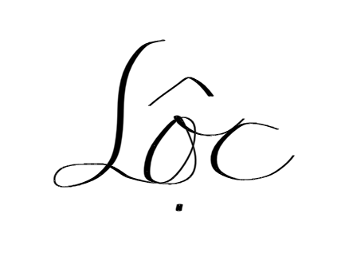

**Faculty of Information Technology (FIT) – Ho Chi Minh City University of Science (HCMUS)**

**CS423 / CSC13003 – Software Testing (AI-augmented · 2026)**

**AI POLICY · TEMPLATES — 2026 v1.0**

# **AI Audit Report — 5-section Template per Artifact**

*Mandatory appendix for every AI-assisted homework (HW\#01–HW\#06, and Seminar).*

*Adapted from Med Kharbach, PhD (2026) — AI Use Policy Templates for Higher Education. CC BY-NC-SA 4.0. This adaptation is prepared for FIT@HCMUS – CS423 / CSC15003 Software Testing course.*

## **1. Student Information**

| Field | Value |
| :---- | :---- |
| **Student name (printed):** | Lê Tuấn Lộc |
| **Student ID:** | 23127404 |
| **Class / Cohort:** | 23KTPM3 |
| **Assignment ID (e.g., HW\#00, HW\#02):** | HW\#01 |
| **Assignment date:** | 08/06/2026 |
| **AI tool(s) used:** | Gemini 3.5 Flash in Antigravity |
| **AI tool(s) used:** | \[x\] Yes  \[ \] No |

## **2. Instructions (read before filling)**

* Add one row per AI-generated artifact (test case, script, checklist, OpenAPI spec, JMeter plan, etc.).  
* Paste the verbatim prompt — DO NOT paraphrase.  
* Paste the verbatim AI output (or include a labelled screenshot in the report).  
* Tag the verdict: VALID / INVALID / INCOMPLETE.  
* Reasoning must cite a course slide, ISTQB section, or technical RFC.  
* Show the corrected artifact with the change highlighted.  
* Sample rows are in italic — replace them before submission.

## **3. Audit Table — one row per artifact**

| (1) Prompt \+ Tool | (2) AI Output | (3) Verdict | (4) Reasoning (ISTQB) | (5) Student Fix |
| :---- | :---- | :---- | :---- | :---- |
| **Artifact \#1** **Tool:** Gemini 3.5 Flash in Antigravity **Time:** 00:14 05/06/2026 **Prompt:** `"dựa vào checklist, hãy tạo template mẫu cho report/Report.md. Có trang bìa đầy đủ."` | Structural template of `Report.md` containing cover page format, outline of Yêu cầu 1, 2, 3, 4, 5, 6, 7. | **VALID** | The generated template structure covers all required sections in `requirements_checklist.md` (ISTQB FL §1.4.3: Testing activities should align with required project documentation). | Accepted as-is and subsequently filled with actual report contents. |
| **Artifact \#2** **Tool:** Gemini 3.5 Flash in Antigravity **Time:** 12:20 05/06/2026 & 09:24 06/06/2026 **Prompt:** `"Bạn là một Chuyên gia Đảm bảo Chất lượng Phần mềm (QA Engineer) cấp cao với khả năng nghiên cứu và phân tích kỹ thuật sâu. Hãy thực hiện nhiệm vụ sau đây dựa trên yêu cầu: Tìm kiếm và liệt kê 20 lỗ hổng/lỗi phần mềm (Software Defects) nổi tiếng được công bố trong giai đoạn 2022–2026. Yêu cầu bắt buộc: Phải có ít nhất 5 lỗi liên quan trực tiếp đến AI/LLM..."` and subsequent correction prompt: `"lỗi từ 16 đến 20 bỏ hết, tìm lại và thay thế hoàn toàn"` | Bulleted list of 20 software defects with sources, severity, consequences, solutions, and AI hallucination detection. | **INCOMPLETE** | Several defects originally had broken links or incorrect source documentation (e.g., defects 16-20 had incorrect CVEs and 404 links). ISTQB FL §1.4.2: Test analysis requires accurate and verified information sources. | Deleted incorrect defects (16-20), re-queried and replaced them with verified NVD NIST CVE entries (CVE-2023-7028, CVE-2023-38831, etc.) and corrected links/descriptions manually. |
| **Artifact \#3** **Tool:** Gemini 3.5 Flash in Antigravity **Time:** 15:43 06/06/2026 & 16:10 06/06/2026 **Prompt:** `"Act as a QA/QC Engineer. Design exactly 15 functional test cases for a standard household electric stand fan (cây quạt máy đứng bình thường). The fan has the following basic features: Power cord and plug; 3 speed buttons; Oscillation knob; Height adjustment clutch/screw; Safety grill and plastic fan blades. Please output the test cases in a markdown table format..."` and subsequent correction prompt: `"TC07 08 thì quạt không có tính năng tăng chỉnh độ cao thân quạt"` | Markdown table with 15 test cases (TC01-TC15) for a household stand fan. | **INCOMPLETE** | The AI assumed the device has height-adjustment features (TC07, TC08) which the actual SUT lacks. It also failed to identify complex physical/environmental edge cases. ISTQB FL §4.1: Test design must be adapted to SUT constraints. | Replaced TC07 & TC08 with tilt-up/tilt-down test cases, and added 3 custom physical edge cases (TC13: concurrent buttons, TC14: air depletion, TC15: reverse torque startup) manually. |

## **4. Summary of AI Accuracy**

Aggregate the verdicts from Section 3 and complete the table below.

| Metric | Count | Percentage |
| :---- | :---- | :---- |
| **Total AI-generated artifacts audited** | 3 | 100% |
| **VALID (correct, accepted as-is)** | 1 | 33.33% |
| **INVALID (wrong; rejected)** | 0 | 0.00% |
| **INCOMPLETE (acceptable after edits)** | 2 | 66.67% |

## **5. Conclusion — When should AI be used (or not)?**

Based on the audit of AI-generated artifacts, several key patterns were observed. The AI excels at generating rapid boilerplate structures, such as the initial Markdown report template and basic functional test cases. However, it struggles with contextual accuracy and physical real-world constraints. For example, it hallucinated a height-adjustment feature for a fixed-height fan and failed to identify physical edge cases like air depletion or reverse torque startup. Furthermore, it generated outdated or broken URLs for software defects, necessitating manual verification. In conclusion, AI should be used for initial drafting, structuring, and brainstorming, but must not be relied upon for precise verification, fact-checking, or designing complex physical/hardware boundary cases.

## **6. Mandatory Disclosure (paste verbatim)**

*"[Report template, 20 software defects, and 15 test cases] was initially generated by [Gemini 3.5 Flash in Antigravity]; I reviewed and modified [the software defects list and the fan test cases], added [edge cases TC13, TC14, TC15]; [the actual execution results, and GitHub issue logging] was written entirely by me. The detailed AI Audit Report is attached as Appendix A. I confirm I did not use AI to generate any artifact listed in the prohibited category."*

## **Signature**

| Student name (printed): | Lê Tuấn Lộc |
| :---- | :---- |
| **Student ID:** | 23127404 |
| **Class / Cohort:** | 23KTPM3 |
| **Course:** | CS423 / CSC13003 – Software Testing |
| **Instructor:** | Dr. Lam Quang Vu / Dr. Tran Duy Hoang / MSc. Tran Thi Bich Hanh / MSc. Truong Phuoc Loc / MSc. Ho Tuan Thanh |
| **Date:** | 08/06/2026 |
| **Signature:** |  |

## **References**

* Kharbach, M. (2026). AI Use Policy Templates for Higher Education. CC BY-NC-SA 4.0.  
* ISTQB Foundation Level Syllabus (latest version).  
* Hardman, P. (2025). A Post-AI Learning Taxonomy.  
* Fuster Rabella, M. (2025). OECD Education Working Paper No. 338.  
* Perkins, M., Roe, J., & Furze, L. (2025). AI Assessment Scale.  
* Anthropic (2025). Building reliable AI test agents — engineering blog.  
* DeepEval & Promptfoo documentation — testing frameworks for LLM systems.