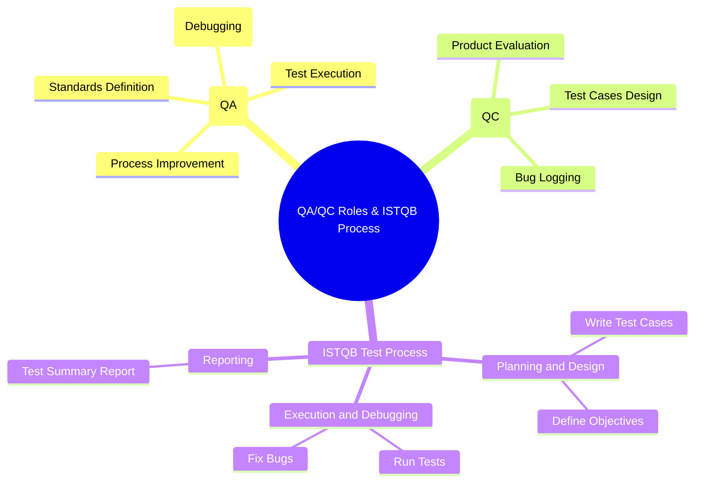
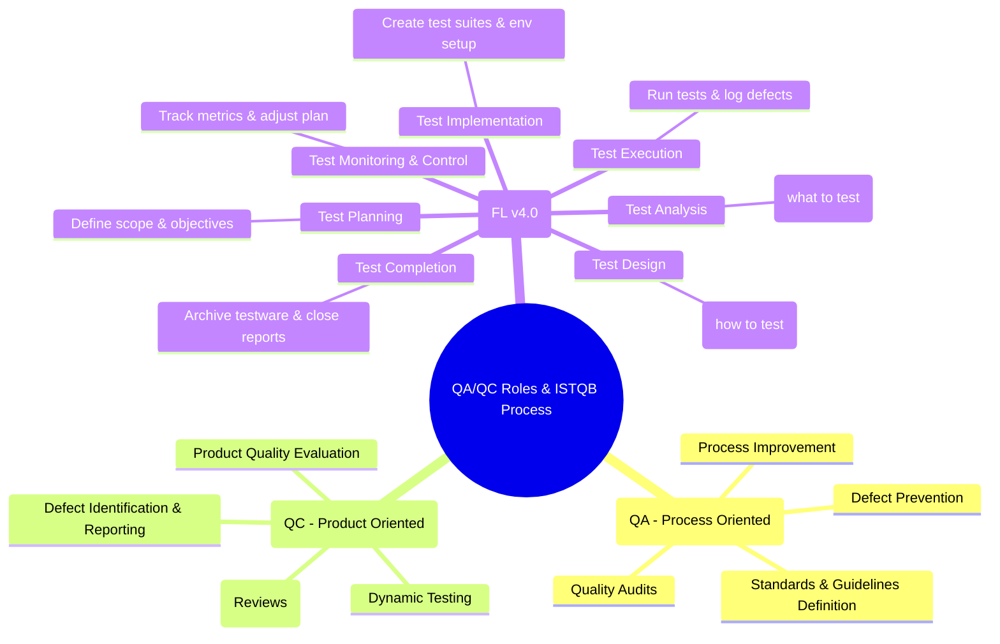

# QA/QC Role & ISTQB Process Mindmap

This file contains the Mermaid mindmap definitions for both the initial AI-generated (incorrect) mindmap and the corrected student version.

## 1. Initial AI-Generated Mindmap (Incorrect)

## 2. Corrected Student Mindmap (ISTQB FL v4.0 Compliant)

